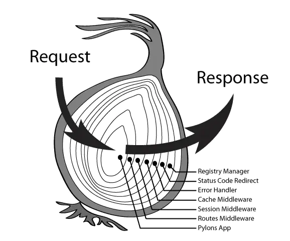

# KOA

```shell
# 安装 koa
npm i koa
# 或者
yarn add koa
```

<https://koa.bootcss.com/>

## 创建WebServer

```javascript
const Koa = require('koa');
// 初始化一个 koa 对象
const app = new Koa();
// 使用 app 对象来创建一个 webserver
/**
 * http.createServer((req, res) => {})
 *
 * (new Http.Server().on('request', (req, res) => {}))
 */
app.listen(8888);
```

## 中间件

在 `Koa` 中，`中间件` 本质上就是用来完成各种具体业务逻辑的函数，通过 `use` 方法来进行注册

```javascript
const Koa = require('koa');
const app = new Koa();
app.use(() => {
  console.log('中间件 - 1');
});
app.listen(8888);
```

## 上下文对象

`Koa` 对 `Request` 和 `Response` 进行了二次封装，提供了更多的特性和方法来完成工作。同时又封装了一个 `Context` 对象，`Koa` 把 `Application`、 `Request`、 `Response` 对象后续其它一些特性方法挂载到该对象上，并在 `中间件` 执行过程中通过第一个参数进行传入：

```javascript
const Koa = require('koa');
const app = new Koa();

app.use((ctx) => {
  console.log('中间件 - 1');
  //只需要把要返回的内容赋值给ctx.body即可，Koa会在最后进行一些处理并end。
  ctx.body = ' 这是返回的内容';
});

app.listen(8888);
```

## Compose

通常，我们的业务是由一系列的完成不同任务的中间件函数组合而成

```javascript
const Koa = require('koa');
const app = new Koa();

app.use((ctx) => {
  console.log('中间件 - 1');
  ctx.body = ' 11111';
});
app.use((ctx) => {
  console.log('中间件 - 2');
  ctx.body = ' 2222';
});
app.listen(8888);
```

上述代码执行的结果是：`只有第一个中间件被执行了` 。原因在于 `Koa` 并非直接通过循环调用的方式去执行每一个中间件，而是在执行当前中间件的时候会把下一个中间件函数作为第二个参数传入。这样，我们就可以在中间件中控制下一个中间件逻辑是否可以继续进行

```javascript
const Koa = require('koa');
const app = new Koa();

// 模拟用户登录数据
let user = null;
// let user = {id: 1, username: 'zMouse'};

app.use((ctx, next) => {
  if (!user) {
      ctx.body = '没有权限';
  } else {
    next();
    ctx.body = `<h1>${ctx.body}</h1>`;
  }
});
app.use((ctx, next) => {
  ctx.body = '用户有权限';
});

app.listen(8888);
```

## 异步中间件

有的时候，我们的中间件逻辑中会包含一些异步任务：

```javascript
const Koa = require('koa');
const app = new Koa();

// 模拟用户登录数据
let user = null;
// let user = {id: 1, username: 'zMouse'};

app.use(async (ctx, next) => {
  if (!user) {
      ctx.body = '没有权限';
  } else {
    //使用await  
    await next();
    ctx.body = `<h1>${ctx.body}</h1>`;
  }
});
app.use((ctx, next) => {
  // 比如读取数据库（异步）
  return new Promise((resolve, reject) => {
    setTimeout(() => {
      ctx.body = '用户有权限';
      resolve();
    }, 1000)
  });
});

app.listen(8888);
```

## 部分实用中间件介绍

### 静态文件代理

```bash
npm i koa-static-cache
```

```javascript
const Koa = require('koa');
const koaStaticCache = require('koa-static-cache'); 
const app = new Koa();

app.use( koaStaticCache({
  // url 中的前缀
  prefix: '/public',
  // url 对应的静态资源存放目录
  dir: './public',
  // 启用 gzip 传输压缩
  gzip: true,
  // 监听静态资源文件变化
  dynamic: true
}) );

app.listen(8888);

//输入如下链接就能访问到public目录下对应的资源
// http://localhost:8888/public/index.html
//http://localhost:8888/public/user.html
```

### 路由

```bash
npm i koa-router
```

```javascript
const Koa = require('koa');
const KoaRouter = require('koa-router'); 
const app = new Koa();

const router = new KoaRouter();

// 路由函数注册
router.get('/', async (ctx, next) => {
  ctx.body = '首页';
});

router.get('/users', async (ctx, next) => {
  ctx.body = '用户列表';
});

// 注册中间件
app.use( router.routes() );

app.listen(8888);

//输入如下链接就能访问到对应的路由返回
//http://localhost:8888
//http://localhost:8888/users
```

### post请求body内容解析

```
npm i koa-body
```

```javascript
const Koa = require('koa');
const KoaRouter = require('koa-router');
const koaBody = require('koa-body');
const fs = require('fs');

const app = new Koa();

const router = new KoaRouter();

// 路由函数注册
router.get('/', async (ctx, next) => {
    ctx.body = fs.readFileSync('./users.html').toString();
});

// 处理 post 提交的数据
router.post('/add', koaBody(), async (ctx, next) => {
    console.log( ctx.request.body);//{ username: 'xxx' }
     ctx.body = '获取成功';
});

// 注册中间件
app.use(router.routes());

app.listen(8888);

```

##### users.html文件

```html
<body>
    <form action="/add" method="post">
        <input type="text" name='username'>
        <button>提交</button>
    </form>
</body>
```

# KOA源码

## Application 对象

通过该对象来初始化并创建 `WebServer` 。

```js
constructor(options) {
  super();
  options = options || {};
  ...
  this.middleware = [];
  this.context = Object.create(context);
  this.request = Object.create(request);
  this.response = Object.create(response);
  ...
}
```

**应用代码**

```
const Koa = require('koa');
const app = new Koa();
```

## listen 方法

`WebServer` 并不是在 `Application` 对象创建的时候就被创建的，而是在调用了 `Application` 下的 `listen` 方法的时候在创建。其本质还是通过 `NodeJS` 内置的 `http` 模块的 `createServer` 方法创建的 `Server` 对象。并且把 `this.callback()` 执行后的结果（函数）作为后续请求的回调函数。

```js
listen(...args) {
  debug('listen');
  const server = http.createServer(this.callback());
  return server.listen(...args);
}
```

**应用代码**

```js
const Koa = require('koa');
const app = new Koa();
app.listen(8888);
```

## 中间件

所谓的中间件函数， `Application` 对象中会提供一个属性 `this.middleware = [];` ，用来存储处理的各种业务函数。这些业务函数通过  `use` 方法进行注册。

```js
constructor() {
  ...
  this.middleware = [];
  ...
}
```

```js
use(fn) {
  ...
  this.middleware.push(fn);
  return this;
}
```

## 中间件的执行流程

```js
callback() {
    //compose 函数将middleware处理为一个函数
    const fn = compose(this.middleware);
    // 有请求时触发，node原生的req和res对象
    const handleRequest = (req, res) => {
        //会调用createContext方法对req和res进行包装，生成Koa另外一个核心对象：Context
        const ctx = this.createContext(req, res);
        return this.handleRequest(ctx, fn);
    };

    return handleRequest;
}

handleRequest(ctx, fnMiddleware) {
    const res = ctx.res;
    res.statusCode = 404;
    const onerror = err => ctx.onerror(err);
    const handleResponse = () => respond(ctx);
    onFinished(res, onerror);
    //这里的 fnMiddleware就是一系列中间件函数执行后结果（一个 Promise 对象），当所有中间件函数执行完成以后，会通过then调用handleResponse也就是调用了 respond这个方法。
    return fnMiddleware(ctx).then(handleResponse).catch(onerror);
}

//响应处理
function respond(ctx) {
     //各种响应处理
     ...
    //发送响应
    res.end(body);
}

function compose(middleware) {
    //返回一个函数接受context, next(调用时没传入参，默认是undefined)
    return function (context, next) {
        return dispatch(0)
        function dispatch(i) {
            let fn = middleware[i]
            //最后一个middleware函数没有next，赋值为undefined
            if (i === middleware.length) fn = next
            if (!fn) return Promise.resolve()
            try {
                // 每次执行时将下一个函数作为第二个参数传入
                return Promise.resolve(fn(context, dispatch.bind(null, i + 1)));
            } catch (err) {
                return Promise.reject(err)
            }
        }
    }
}
```

**应用代码**

```js
const Koa = require('koa');
const app = new Koa();

app.use(async (ctx, next) => {
   console.log('a - start');
   next();
   console.log('a - end');
});

app.use(async (ctx, next) => {
    console.log('b - start');
    next();
    console.log('b - end');
 });

app.use(async (ctx, next) => {
    console.log('c - start');
    next();
    console.log('c - end');
 });

app.listen(8888);

输出
a - start
b - start
c - start
c - end
b - end
a - end
```

### 洋葱模型



## Context 对象

提供一些基础方法，同时对 `Request` 和 `Response` 对象做了代理访问

### context 对象的初始化

在 `Application` 对象初始化的时候，会创建一个 `Context` 对象，并挂载到 `Application` 的 `context` 属性下。同时在callback执行的时候，还会对这个 `context` 进行包装，并把包装后的 `context` 对象作为中间件函数的第一个参数。

```js
//接受node原生的req和res对象
createContext(req, res) {
  const context = Object.create(this.context);
  const request = context.request = Object.create(this.request);
  const response = context.response = Object.create(this.response);
  context.app = request.app = response.app = this;
  context.req = request.req = response.req = req;
  context.res = request.res = response.res = res;
  request.ctx = response.ctx = context;
  request.response = response;
  response.request = request;
  context.originalUrl = request.originalUrl = req.url;
  context.state = {};
  return context;
}
```

##### 一个简单代理示例

```js
const delegate = require('delegates');
class test {
    constructor() {
        this.req = {
          nodeHeaders: 'node headers'
        }
        this.resquest = {
            get header() {
                return this.req.nodeHeaders;
            },

            set header(val) {
                this.req.nodeHeaders = val;
            },
        }
        this.context = {
            utils() {
                console.log('一些工具函数');
            }
        }
        // 通过代理，直接用context访问resquest下的属性
        delegate(this.context, 'resquest')
        .access('header')
    }

    createContext() {
        const context = Object.create(this.context);
        const resquest = context.resquest = Object.create(this.resquest);
        context.req = resquest.req = this.req;
        return context
    }
}

const a = new test()
const context = a.createContext()

console.log(context.resquest.header);//node headers
console.log(context.header);//node headers
```

### ctx.state 属性

有的时候，我们需要在多个中间件中传递共享数据，虽然可以通过 `context` 对象进行挂载，但是这样会对 `context` 对象造成污染， `context` 对象提供了一个专门用来共享这类用户数据的命名空间（ `context.state = {}` ）。

**应用代码**

```js
const Koa = require('koa');
const app = new Koa();

app.use(async (ctx, next) => {
  ctx.state.user = {id: 1, name: 'zMouse'};
});
app.use(async (ctx, next) => {
  ctx.body = `Hello, ${ctx.state.user.name}`;
});

app.listen(8888);
```
