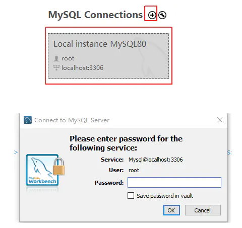
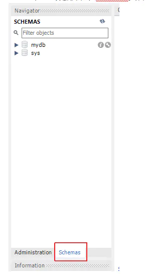
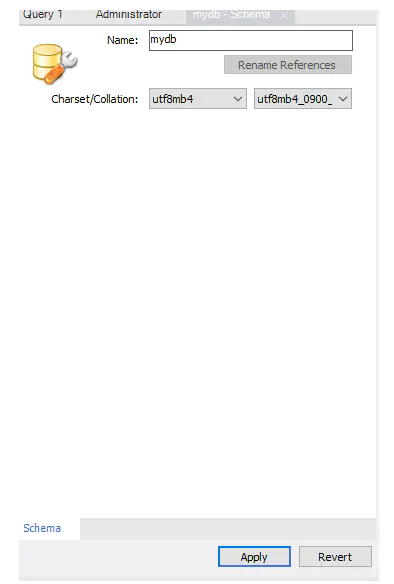
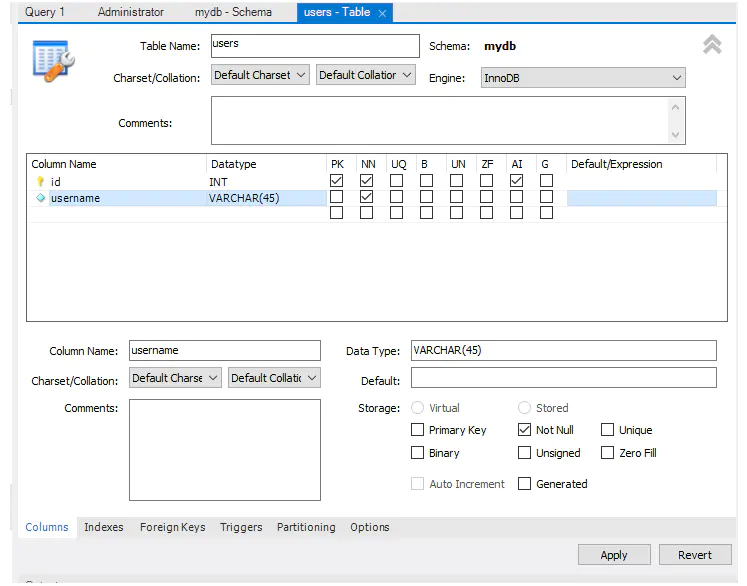
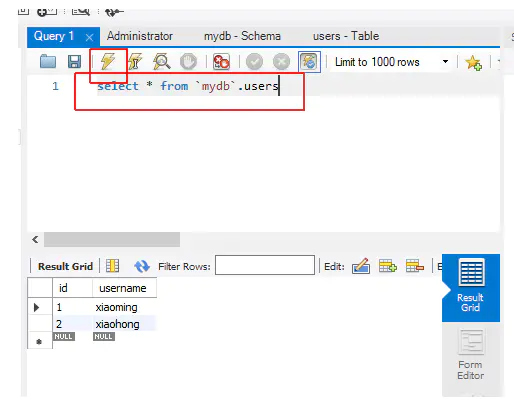

## MySQL 的安装

### MySQL服务下载

地址：<https://dev.mysql.com/downloads/installer/>

可以通过 右击我的电脑-->管理-->服务和应用程序-->服务,查看mysql是否启动

安装完成后自动启动


### MySQL图形化操作界面下载

地址：<https://dev.mysql.com/downloads/workbench/>

安装成功后设置对应的端口并输入密码进入数据库



创建一个新的数据库，在schemas页右击，选择create选项


设置数据库名称为mydb，并且设置字符编码



新建一张表名为users，并设置对应的字段名



```sql
//图形化的操作对应的sql语句
CREATE TABLE `mydb`.`users` (
  `id` INT NOT NULL AUTO_INCREMENT,
  `username` VARCHAR(45) NOT NULL,
  PRIMARY KEY (`id`));
```

可以通过输入sql语句查看表内的数据，输入完语句按黄色小闪电执行



## mysql基本概念介绍

### **C/S**

`MySQL` 使用 `C/S` 模式（客户端/服务端），由客户端发起连接请求 `MySQL` 服务器来完成对数据库数据的各种操作。

### **结构**

```js
'XX数据库' = {
  "用户表": [ // 一组具有相同特性的记录的集合
    // 记录
    {
      // 字段：id，值：1
      "id": 1,
      // 字段：username，值："DaHai"
      "username": "DaHai"
    },
    {
      "id": 2,
      "username": "zMouse"
    }
  ],
  "商品表": [],
  ...
}
```

## 在Node.js中使用mysql

### 安装

```sh
npm i mysql2
```

```js
//回调版本风格
const mysql = require('mysql2');
//基于 Promise 版本风格
const mysql = require('mysql2/promise');
```

### 链接数据库

```js
const connection = await mysql.createConnection({
      host: 'localhost',
      user: 'root',
      password: '123456789',
      database: 'mydb'
});
```

### 一个简单的完整示例

```js
const fs = require('fs')
const Koa = require('koa');
const KoaRouter = require('koa-router');
const koaBody = require('koa-body');
const mysql = require('mysql2/promise');

const app = new Koa();

// 数据链接
let connection = null;
app.use(async (ctx, next) => {
  if (!connection) {
    connection = await mysql.createConnection({
      host: 'localhost',
      user: 'root',
      password: '123456789',
      database: 'mydb'
    });
  }

  await next();
})


// 路由
const router = new KoaRouter();


// 获取添加用户数据页面
router.get('/', async (ctx, next) => {
  ctx.body = fs.readFileSync('./users.html').toString();
});

// 处理 post 提交的用户数据
router.post('/add', koaBody(), async (ctx, next) => {
  console.log(ctx.request.body);//{ username: 'xxx' }
  let { username } = ctx.request.body;
  // 向数据库中插入数据
  await connection.query(
    "insert into `users` (`username`) values (?)",
    // 下面数组中的每一个值对应替换sql语句中每一个？，如果有多个数据替换用多个？号
    [username]
  )
  ctx.body = '添加成功';
});
// 查询用户数据列表
router.get('/users', async (ctx, next) => {
  let sql = "select `id`, `username` from `users`";
  let [users] = await connection.query(sql);
  ctx.body = users
});

app.use(router.routes());

app.listen(8888);
```

##### users.html文件

```html
<body>
    <form action="/add" method="post">
        <input type="text" name='username'>
        <button>提交</button>
    </form>
</body>
```

### 另一个连接数据库的工具
<https://www.prisma.io/>
