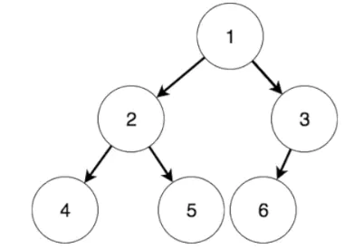
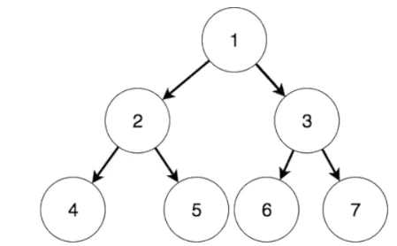

### 二叉树

相比较链表只有一个指针指向下一个，二叉树的节点有两个指针分别指向左节点，右节点。

节点：指树上的每个元素

节点的度：节点有几个儿子节点

叶子节点：没有儿子节点的节点

树的深度：也称为树的高度，所有节点的层次最大值


#### 完全二叉树

深度为k的完全二叉树，从第1层到第k-1层都是满的，第k层，或是满的或是从右向左连续缺若干个节点



#### 满二叉树/完美二叉树

国内外叫法不一样。

每一层都达到了可以容纳的最大数量的节点



## 二叉树的遍历

根据根节点所在的位置，依次称为：

前序遍历

```js
var preorderTraversal = function(root) {
   if(!root){
       return []
   }
   let ary = []
   ary.push(root.val)
   ary.push(...preorderTraversal(root.left))
   ary.push(...preorderTraversal(root.right))
   return ary
};
```

中序遍历

```js
var inorderTraversal = function(root) {
   if(!root){
       return []
   }
   let ary = []
   ary.push(...inorderTraversal(root.left))
   ary.push(root.val)
   ary.push(...inorderTraversal(root.right))
   return ary
};
```

后序遍历

```js
var postorderTraversal = function(root) {
   if(!root){
       return []
   }
   let ary = []
   ary.push(...postorderTraversal(root.left))
   ary.push(...postorderTraversal(root.right))
   ary.push(root.val)
   return ary
};
```

## ⼆叉搜索树（Binary Search Tree）

指⼀棵空树或者具有下列性质的⼆叉树：

1. 若任意节点的左⼦树不空，则左⼦树上所有结点的值均⼩于它的根结点的值；
2. 若任意节点的右⼦树不空，则右⼦树上所有结点的值均⼤于它的根结点的值；
3. 任意节点的左、右⼦树也分别为⼆叉搜索树


#### [98\. 验证二叉搜索树](https://leetcode.cn/problems/validate-binary-search-tree/)

## Trie树

即字典树，⼜称单词查找树或键树。典型应⽤是⽤于统计和排序⼤量的字符串（但不仅限于字符串），经常被搜索引擎系统⽤于⽂本词频统计。
它的优点是：最⼤限度地减少⽆谓的字符串⽐较。
Trie的核⼼思想是空间换时间。利⽤字符串的公共前缀来降低查询时间的开销以达到提⾼效率的⽬的。

1. 根节点不包含字符，除根节点外每⼀个节点都只包含⼀个字符。
2. 从根节点到某⼀节点，路径上经过的字符连接起来，为该节点对应的字符串。
3. 每个节点的所有⼦节点包含的字符都不相同。


#### [208\. 实现 Trie (前缀树)](https://leetcode.cn/problems/implement-trie-prefix-tree/)
