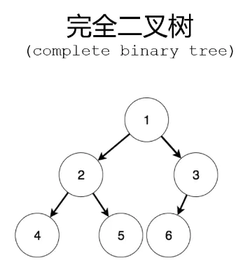
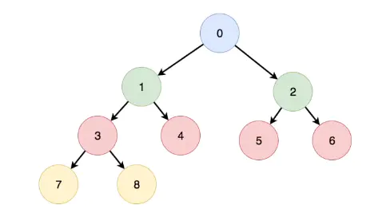
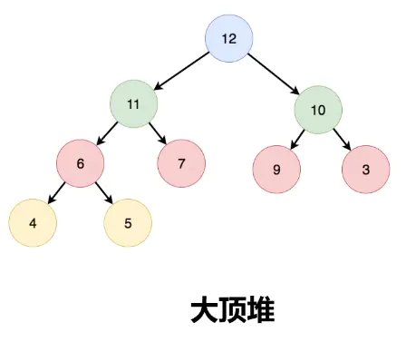

# 堆

## 堆的定义

堆的背后逻辑是完全二叉树，但具体的实现是用数组。

对于一颗完全二叉树，节点间有如下关系：编号为i的节点，左孩子为 `2*i`,右孩子为```2*i+1```



如果转换成数组存储，因为数组的下标从0开始，便有左孩子为 `2*i+1`,右孩子为```2*i+2```



堆有大顶堆和小顶堆，大顶堆的父节点总是大于等于两个子节点，小顶堆就是父节点总是小于等于两个子节点。



## 堆的实现

堆有两个操作：

从尾部插入新的数据，然后向上调整

从顶部弹出最大/小的数据，然后将堆的最后一个元素移到头部，然后向下调整。

### 实现最大堆

```js
function Head() {
    this.data = []
}

// 入堆
Head.prototype.push = function (item) {
    this.data.push(item)
    this.siftUp(this.data.length - 1)
}
//向上调整
Head.prototype.siftUp = function (index) {
    // 父index为 (index-1)>>1，只要父节点比子节点小就向上调整
    while (index !== 0 && this.data[(index - 1) >> 1] < this.data[index]) {
        [this.data[(index - 1) >> 1], this.data[index]] = [this.data[index], this.data[(index - 1) >> 1]]
        index = (index - 1) >> 1
    }
}
// 出堆，将堆的最后一个元素移到头部，然后向下调整。
Head.prototype.pop = function () {
    let top = this.data[0]
    let length = this.data.length
    this.data[0] = this.data[length - 1]
    this.data.length = length - 1
    this.siftDown(0)
    return top
}
//向下调整
Head.prototype.siftDown = function (index) {
    // 当有左子节点时
    while (this.data[2 * index + 1]) {
        let leftIndex = 2 * index + 1
        let rightIndex = 2 * index + 2
        let topIndex = index
        // 寻找index，leftIndex，rightIndex对应节点值的最大值
        if (this.data[leftIndex] > this.data[topIndex]) {
            topIndex = leftIndex
        }
        if (this.data[2 * index + 2] && this.data[rightIndex] > this.data[topIndex]) {
            topIndex = rightIndex
        }
        // 此时topIndex就是index，leftIndex，rightIndex的最大值
        // 如果当前节点就是最大值，break，否则交换后进行下一轮比较
        if (topIndex == index) {
            break
        } else {
            [this.data[topIndex], this.data[index]] = [this.data[index], this.data[topIndex]]
            index = topIndex
        }
    }
}
```

### 实现堆化

支持传入一个数组，直接将数组堆化.。

将数组堆化的逻辑：
取数组的`(this.data.length - 1) >> 1`坐标,然后往0遍历依次执行向下调整

```js
Head.prototype.heapify = function () {
    let index = (this.data.length - 1) >> 1
    for (let i = index; i >= 0; i--) {
        this.siftDown(i)
    }
}
```

### 实现排序方式扩展

可以像数组的sort函数一样，接受一个比较函数，来实现自定义排序方式。

```js
function Head(data = [], compareFn = (a, b) => a - b > 0) {
    this.data = data
    this.compareFn = compareFn
    this.data.length && this.heapify()
}

//堆化
Head.prototype.heapify = function () {
    let index = (this.data.length - 1) >> 1
    for (let i = index; i >= 0; i--) {
        this.siftDown(i)
    }
}

// 入堆
Head.prototype.push = function (item) {
    this.data.push(item)
    this.siftUp(this.data.length - 1)
}

//向上调整
Head.prototype.siftUp = function (index) {
    // 父index为 (index-1)>>1
    while (index !== 0 && this.compareFn(this.data[index], this.data[(index - 1) >> 1])) {
        [this.data[(index - 1) >> 1], this.data[index]] = [this.data[index], this.data[(index - 1) >> 1]]
        index = (index - 1) >> 1
    }
}
// 出堆，将堆的最后一个元素移到头部，然后向下调整。
Head.prototype.pop = function () {
    let top = this.data[0]
    let length = this.data.length
    this.data[0] = this.data[length - 1]
    this.data.length = length - 1
    this.siftDown(0)
    return top
}
//向下调整
Head.prototype.siftDown = function (index) {
    // 当有左子节点时
    while (this.data[2 * index + 1]) {
        let leftIndex = 2 * index + 1
        let rightIndex = 2 * index + 2
        let topIndex = index
        // 寻找index，leftIndex，rightIndex对应节点值的最值
        if (this.compareFn(this.data[leftIndex], this.data[topIndex])) {
            topIndex = leftIndex
        }
        if (this.data[2 * index + 2] && this.compareFn(this.data[rightIndex], this.data[topIndex])) {
            topIndex = rightIndex
        }
        // 此时topIndex就是index，leftIndex，rightIndex的最值
        // 如果当前节点就是最值，break，否则交换后进行下一轮比较
        if (topIndex == index) {
            break
        } else {
            [this.data[topIndex], this.data[index]] = [this.data[index], this.data[topIndex]]
            index = topIndex
        }
    }
}

//a - b > 0 大顶堆
function compareFn(a, b) {
    return a.number - b.number > 0
}

let q = new Head([], compareFn)
q.push({ number: 1 })
q.push({ number: 2 })
q.push({ number: 3 })
q.push({ number: 4 })
q.push({ number: 5 })

console.log(q.data)
```

## 堆的作用

一般来说，适合维护一个集合的最值
